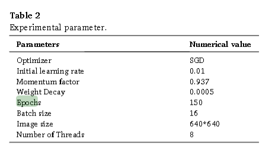

# 🐟 Abstract

bahas mengenai taksononmi non-invasif, tidak memengaruhi hewannya sehingga tidak mati

Medaka (*Oryzias*) fish, such as the Java medaka (*Oryzias javanicus*) and Celebes medaka (*Oryzias celebensis*), play vital roles in maintaining biodiversity and balance in the aquatic ecosystem of Indonesia. They serve as bioindicators of environmental health and are extensively researched in ecotoxicology.  

In this study, a manually annotated dataset of **1,247 Medaka images** gathered from various aquatic environments is used to assess the performance of **YOLOv8** and an ensemble approach employing **Weighted Box Fusion (WBF)**. Five models were trained and validated using **5-fold cross-validation**.  

- With an **mAP@0.5:0.95 of 0.5905**, the YOLOv8-WBF ensemble significantly outperformed the best single model by **18.6% (0.4979)**.  
- Precision gains reached up to **82%** at ideal confidence thresholds.  
- The ensemble method showed superior bounding box localisation and classification reliability, especially for **small and visually challenging fish instances**.  
- Computational efficiency dropped by about **4.3×** compared to single models, but improved accuracy is valuable for **ecological monitoring and conservation workflows**.  

This work sets a **benchmark for ensemble-based aquatic species detection systems** and contributes to more robust biodiversity monitoring by:  
- Improving detection consistency across environmental variations.  
- Reducing missed detections of rare species by **23%**.  

---

# 📖 1. Introduction

## Our Augmentation

Preprocessing:
Auto-Orient: Applied
Resize: Stretch to 640x640

Augmentations (3x Original Images):
Outputs per training example: 3
Flip: Horizontal
90° Rotate: Clockwise, Counter-Clockwise

Dataset Distribution:
Experiment 1 Single YOLOv8: 10% Test, Remaining 90% -> 92% Train, 8% Valid
Experiment 2 5-fold Cross Validation: 10% Test, Remaining 90% -> 80% Train, 20% Valid

## ✨ Augmentation in Related Works

### 🔹 CEH-YOLO  
- Integrated image and label data.  
- Applied **horizontal rotation** and **saturation adjustment**.  
- Goal: enhance image data diversity.
- All the experiments were executed on a hardware platform equipped
with an NVIDIA RTX 3090 GPU with 24 GB of memory, running the
Ubuntu operating system and CUDA version 11.1. The deep learning
framework employed was PyTorch version 1.10.1. Throughout the
training phase, the model utilized a learning rate of 0.01, along with a
batch size of 8 images, each with an input dimension of 1280 × 1280.
The number of threads was configured to 4, and the training procedure
spanned 400 epoch  

---

### 🔹 YOLO-SAG  
- Simulated **real field environments** through augmentation.  
- Used **7 augmentation methods**:  
  - Rotation  
  - Brightness adjustment  
  - Color enhancement  
  - Gaussian noise  
  - Gaussian blurring  
  - Color inversion  
  - Perspective transformation & edge detection  
- Simulated effects of intense light, shade, dirty lenses, variable weather, blur, and night photography.  
- Goal: improve generalization and stability in **complex and dynamic environments**.  

---

### 🔹 Automated Species Classification (Deep-sea crawler)  
- Used **2 augmentations**:  
  - Random Brightness Adjustment (**±20%**)  
  - Random Gaussian Blur (**0–3.5 px**)  
- Goal: improve generalization and versatility.  

---

### 🔹 Neotropical Brown Stink Bug Detection  
- Augmentation **diversified the dataset**.  
- Applied **random saturation adjustments**, doubling outputs per training example.  
- Dataset split:  
  - **82% training (4000 images)**  
  - **13% validation (607 images)**  
  - **5% testing (260 images)**  
- Helped prevent overfitting and ensured generalization.  
- We chose YOLOv8n version 8.0.99 as the baseline model for the
ablation experiments. The input image resolution was set to 640 × 640,
and 100 epochs were trained under a batch size 150.
This work used Google Colab, a browser-based coding platform that
provides free GPU resources. Specifically, we used the Google Colab
Pro+ version, which offers priority access to more powerful GPUs and
high-memory virtual machines compared to the free version. We used
the NVIDIA A100-SXM4-40GB GPU, specifically, a high-performance
GPU with 40GB memory.

---

### 🔹 WBF Ensembling Boxes (Different Detection Models)  
- Notes on **ensemble limitations**:  
  - Single-model post-processing cannot average localization well.  
  - Ensembles improve generalization and accuracy.  
- **Test-time augmentation (TTA)**:  
  - Run inference on original and augmented images (e.g., flips).  
  - Average predictions for better robustness.  

---

### 🔹 Face Detection via Ensemble of YOLO Variants  
- Used **4 YOLO versions** and ensembled outputs.  
- Benefits:  
  1. Increased number of bounding boxes predicted.  
  2. One model compensates where others fail.  
- Example: a face detected only by YOLOv1, missed by others.  

CARVING-DETECTION:

Medaka Oryzias Dataset:

Train Set
72% 820 Images
Valid Set
18% 206 Images
Test Set
10% 113 Images

O.celebensis 641
O.javanicus 639

A new lacustrine ricefish from central Sulawesi, with a redescription of Oryzias marmoratus (Teleostei: Adrianichthyidae)
Full Paper
Published: 30 March 2023
Volume 70, pages 490–514, (2023)

mixture datset digunakan karena kelangkaannya yang bahkan peneliti biologi susah menemukan dimana manual capture dan data internet digabung (dataset bagus dan dataset real life)
PSNR (Peak Signal-to-Noise Ratio) is a metric used in signal and image processing to quantify the quality of a compressed or reconstructed signal compared to its original

